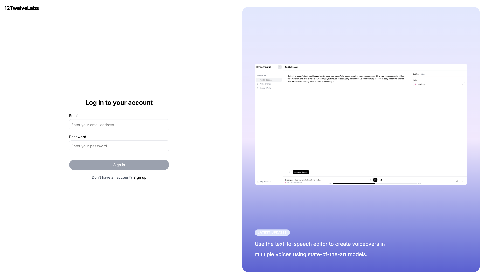
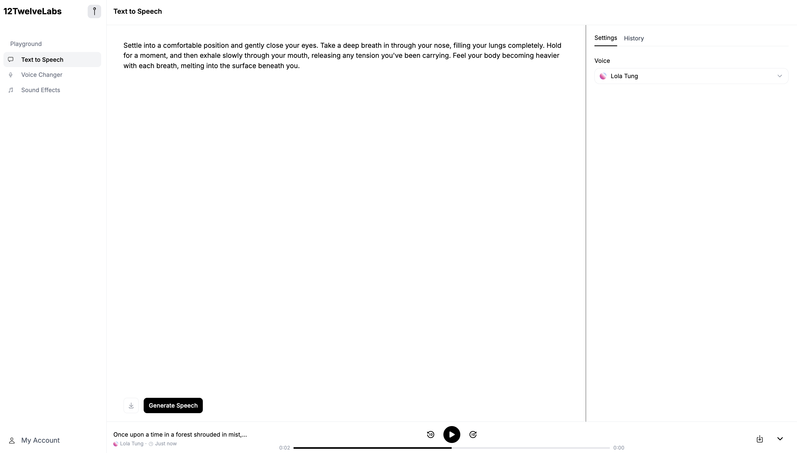

# elevenlabs-clone

A text-to-speech, voice conversion, and sound effects generator inspired by ElevenLabs.

## Features

- Text-to-speech synthesis with StyleTTS2

- Voice conversion with Seed-VC

- Audio generation from text with Make-An-Audio

- Docker Containerization of AI models

- Custom voice finetuning with AWS (EC2, ECR)

- AWS S3 for voice style storage

- User authentication with Auth.js

## Examples

